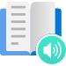

# Azure AI Services

## Contents

## Overview

|   |   |   |   |   |   |
|:-:|:-:|:-:|:-:|:-:|:-:|
| [ **Language**](#language) | [ **Translator**](#translator) | [ **Speech**](#speech) | [ **Vision**](#vision) | [ **Custom Vision**](#custom-vision) | [ **Face**](#face) | 
| [ **Video Indexer**](#video-indexer) | [ **Document Intelligence**](#document-intelligence) | [ **Content Safety**](#content-safety) | [ **Cognitive Search**](#cognitive-search) | [ **Bot Service**](#bot-service) | [ **Metrics Advisor**](#metrics-advisor) |
| [ **Immersive Reader**](#immersive-reader) | [ **Anomaly Detector**](#anomaly-detector) | [ **Personalizer**](#personalizer) | [ **OpenAI**](#openai) |

## Language

[][language]

A host of capabilities for understanding human language.

### Links

| Link            | URL                                                                   |
|:----------------|:----------------------------------------------------------------------|
| Documentation   | https://learn.microsoft.com/en-us/azure/ai-services/language-service/ |
| Language Studio | https://language.cognitive.azure.com/                                 |

### Capabilities

| #  | Capability                                                                                                                                                               |
|----|:-------------------------------------------------------------------------------------------------------------------------------------------------------------------------|
| 1  | [Language Detection](https://learn.microsoft.com/en-us/azure/ai-services/language-service/language-detection/overview)                                                   |
| 2  | [Key Phrase Extraction](https://learn.microsoft.com/en-us/azure/ai-services/language-service/key-phrase-extraction/overview)                                             |
| 3  | [Conversational Language Understanding (CLU)](https://learn.microsoft.com/en-us/azure/ai-services/language-service/conversational-language-understanding/overview)       |
| 4  | [Named Entity Recognition (NER)](https://learn.microsoft.com/en-us/azure/ai-services/language-service/named-entity-recognition/overview)                                 |
| 5  | [Entity Linking](https://learn.microsoft.com/en-us/azure/ai-services/language-service/entity-linking/overview)                                                           |
| 6  | [Personally Identifiable Information (PII) Detection](https://learn.microsoft.com/en-us/azure/ai-services/language-service/personally-identifiable-information/overview) |
| 7  | [Sentiment Analysis and Opinion Mining](https://learn.microsoft.com/en-us/azure/ai-services/language-service/sentiment-opinion-mining/overview)                          |
| 8  | [Summarization](https://learn.microsoft.com/en-us/azure/ai-services/language-service/summarization/overview)                                                             |
| 9  | [Question Answering](https://learn.microsoft.com/en-us/azure/ai-services/language-service/question-answering/overview)                                                   |
| 10 | [Custom Text Classification](https://learn.microsoft.com/en-us/azure/ai-services/language-service/custom-text-classification/overview)                                   |
| 11 | [Text Analytics for Health](https://learn.microsoft.com/en-us/azure/ai-services/language-service/text-analytics-for-health/overview)                                     |

## Translator

[][translator]

Translate between human languages.

### Links

| Link                     | URL                                                             |
|:-------------------------|:----------------------------------------------------------------|
| Documentation            | https://learn.microsoft.com/en-us/azure/ai-services/translator/ |
| Custom Translator Studio | https://portal.customtranslator.azure.ai/                       |

### Capabilities

| # | Capability                                                                                                           |
|---|:---------------------------------------------------------------------------------------------------------------------|
| 1 | [Text Translation](https://learn.microsoft.com/en-us/azure/ai-services/translator/text-translation-overview)         |
| 2 | [Document Translation](https://learn.microsoft.com/en-us/azure/ai-services/translator/document-translation/overview) |
| 3 | [Custom Translator](https://learn.microsoft.com/en-us/azure/ai-services/translator/custom-translator/overview)       |

## Speech

[][speech]

Recognise and generate human speech.

### Links

| Link          | URL                                                                 |
|:--------------|:--------------------------------------------------------------------|
| Documentation | https://learn.microsoft.com/en-us/azure/ai-services/speech-service/ |
| Speech Studio | https://speech.microsoft.com/                                       |

## Vision

[][vision]

Recognise objects in visual data.

### Links

| Link          | URL                                                                  |
|:--------------|:---------------------------------------------------------------------|
| Documentation | https://learn.microsoft.com/en-us/azure/ai-services/computer-vision/ |

### Capabilities

## Custom Vision

1. **Custom Vision**
   - https://learn.microsoft.com/en-us/azure/ai-services/custom-vision-service/
1. **Face**
   - https://learn.microsoft.com/en-us/azure/ai-services/computer-vision/overview-identity
1. **Video Indexer**
   - https://learn.microsoft.com/en-us/azure/azure-video-indexer/
1. **Document Intelligence**
   - https://learn.microsoft.com/en-us/azure/ai-services/document-intelligence/
1. **OpenAI**
   - https://learn.microsoft.com/en-us/azure/ai-services/openai/
1. **Cognitive Search**
   - https://learn.microsoft.com/en-us/azure/search/
1. **Bot Service**
   - https://learn.microsoft.com/en-us/azure/bot-service/
1. **Metrics Advisor**
   - https://learn.microsoft.com/en-us/azure/ai-services/metrics-advisor/
1. **Immersive Reader**
   - https://learn.microsoft.com/en-us/azure/ai-services/immersive-reader/
1. **Anomaly Detector**
   - https://learn.microsoft.com/en-us/azure/ai-services/anomaly-detector/
1. **Content Safety**
   - https://learn.microsoft.com/en-us/azure/ai-services/content-safety/
1. **Personalizer**
   - https://learn.microsoft.com/en-us/azure/ai-services/personalizer/

## Deprecated AI Services

The following services are deprecated:

1. **Language Understanding Intelligent System (LUIS)**
   - https://learn.microsoft.com/en-us/azure/cognitive-services/luis/
     > Superseded by [Conversational Language Understanding (CLU)](https://learn.microsoft.com/en-us/azure/ai-services/language-service/conversational-language-understanding/overview) in the [Language](https://learn.microsoft.com/en-us/azure/ai-services/language-service/) service.
1. **QnA Maker**
   - https://learn.microsoft.com/en-us/azure/cognitive-services/qnamaker/
     > Superseded by [Question Answering](https://learn.microsoft.com/en-us/azure/ai-services/language-service/question-answering/overview) in the [Language](https://learn.microsoft.com/en-us/azure/ai-services/language-service/) service.
1. **Form Recognizer**
   - https://learn.microsoft.com/en-us/azure/applied-ai-services/form-recognizer/
     > Not really deprecated, just renamed to [Document Intelligence](https://learn.microsoft.com/en-us/azure/ai-services/document-intelligence/).

## Documentation

| #  | Service                   | URL                                                                                   |
|----|:--------------------------|:--------------------------------------------------------------------------------------|
| 1  | **Language**              | https://learn.microsoft.com/en-us/azure/ai-services/language-service/                 |
| 2  | **Translator**            | https://learn.microsoft.com/en-us/azure/ai-services/translator/                       |
| 3  | **Speech**                | https://learn.microsoft.com/en-us/azure/ai-services/speech-service/                   |
| 4  | **Vision**                | https://learn.microsoft.com/en-us/azure/ai-services/computer-vision/                  |
| 5  | **Custom Vision**         | https://learn.microsoft.com/en-us/azure/ai-services/custom-vision-service/            |
| 6  | **Face**                  | https://learn.microsoft.com/en-us/azure/ai-services/computer-vision/overview-identity |
| 7  | **Video Indexer**         | https://learn.microsoft.com/en-us/azure/azure-video-indexer/                          |
| 8  | **Document Intelligence** | https://learn.microsoft.com/en-us/azure/ai-services/document-intelligence/            |
| 9  | **OpenAI**                | https://learn.microsoft.com/en-us/azure/ai-services/openai/                           |
| 10 | **Cognitive Search**      | https://learn.microsoft.com/en-us/azure/search/                                       |
| 11 | **Bot Service**           | https://learn.microsoft.com/en-us/azure/bot-service/                                  |
| 12 | **Metrics Advisor**       | https://learn.microsoft.com/en-us/azure/ai-services/metrics-advisor/                  |
| 13 | **Immersive Reader**      | https://learn.microsoft.com/en-us/azure/ai-services/immersive-reader/                 |
| 14 | **Anomaly Detector**      | https://learn.microsoft.com/en-us/azure/ai-services/anomaly-detector/                 |
| 15 | **Content Safety**        | https://learn.microsoft.com/en-us/azure/ai-services/content-safety/                   |
| 16 | **Personalizer**          | https://learn.microsoft.com/en-us/azure/ai-services/personalizer/                     |

<table>
  <tr>
    <td><a href="#language"> <b>Language</b></a></td>
    <td><a href="#translator"> <b>Translator</b></a></td>
    <td><a href="#speech"> <b>Speech</b></a></td>
    <td><a href="#vision"> <b>Vision</b></a></td>
    <td><a href="#custom-vision"> <b>Custom Vision</b></a></td>
    <td><a href="#face"> <b>Face</b></a></td>
  </tr>
  <tr>
    <td><a href="#video-indexer"> <b>Video Indexer</b></a></td>
    <td><a href="#document-intelligence"> <b>Document Intelligence</b></a></td>
    <td><a href="#openai"> <b>OpenAI</b></a></td>
    <td><a href="#cognitive-search"> <b>Cognitive Search</b></a></td>
  </tr>
</table>

[language]: https://learn.microsoft.com/en-us/azure/ai-services/language-service/
[translator]: https://learn.microsoft.com/en-us/azure/ai-services/translator/
[speech]: https://learn.microsoft.com/en-us/azure/ai-services/speech-service/
[vision]: https://learn.microsoft.com/en-us/azure/ai-services/computer-vision/
[custom-vision]: https://learn.microsoft.com/en-us/azure/ai-services/custom-vision-service/
[face]: https://learn.microsoft.com/en-us/azure/ai-services/computer-vision/overview-identity/
[video-indexer]: https://learn.microsoft.com/en-us/azure/azure-video-indexer/
[document-intelligence]: https://learn.microsoft.com/en-us/azure/ai-services/document-intelligence/
[openai]: https://learn.microsoft.com/en-us/azure/ai-services/openai/
[cognitive-search]: https://learn.microsoft.com/en-us/azure/search/
[bot-service]: https://learn.microsoft.com/en-us/azure/search/
[metrics-advisor]: https://learn.microsoft.com/en-us/azure/ai-services/metrics-advisor/
[immersive-reader]: https://learn.microsoft.com/en-us/azure/ai-services/immersive-reader/
[anomaly-detector]: https://learn.microsoft.com/en-us/azure/ai-services/immersive-reader/
[content-safety]: https://learn.microsoft.com/en-us/azure/ai-services/immersive-reader/
[personalizer]: https://learn.microsoft.com/en-us/azure/ai-services/immersive-reader/

